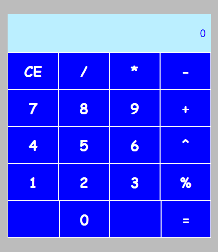

# React App | XP Inc & Dio 

Criando uma Calculadora com React

## Operações entre 2 numeros inteiros

1. Entre com o primeiro operando.
2. Seleciona a operação.
3. Entre com o segundo operando.
4. Clica no sinal de igual(=) para obter o resultado.

In the project directory, you can run:

### `npm start`
Runs the app in the development mode.\
Open [http://localhost:3000](http://localhost:3000) to view it in your browser.

### `npm run build`
Builds the app for production to the `build` folder.\
